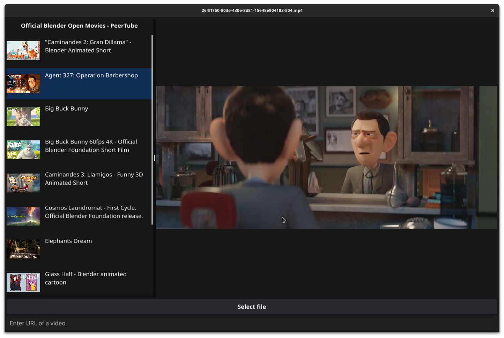

<div align="center">
    <a href="https://pkg.go.dev/github.com/metal3d/fyne-streamer"></a>
    <a href="https://goreportcard.com/report/github.com/metal3d/fyne-streamer"></a>
</div>

# Gstreamer with Fyne - Audio/Video Widget

Fyne-Streamer offers you a number of widgets that will enable you to display videos or manipulate sound with your applications developed with [Fyne](https://fyne.io).

Fyne-Streamer uses Gstreamer, a cross-platform, high-performance and easy-to-use framework. It offers a large variety of filters, effects, decoders and encoders.

For the moment, Fyne-Streamer doesn't provide an Audio widget (but it will soon), although the video widget plays video sound correctly.

## Installation

To install these widgets, you must first have the Gstreamer development files on your workstation. You need to install:

- gstreamer-devel
- gstreamer-app-devel

On Windows, you need to download Gstreamer and follow the configuration suggested by the [Go-GST](https://github.com/go-gst/go-gst) package in the [Windows](https://github.com/go-gst/go-gst#windows) section.

> **Important** On Windows, it seems that the only MingW version that successfuly builds go-gst is <= 11. Also, you **must** add the "bin" directory of "Gstreamer" (mingw version) in the "Path" environment to avoid copying the DLLs to your working directory.
>
> See our Wike page: https://github.com/metal3d/fyne-streamer/wiki/Installation-on-Windows

For Mac users, you should be fine with "HomeBrew".

Android, iOs...

> **At this time, although Gstreamer is compatible with Android and iOS, we can't provide documentation on how to compile your applications with Fyne-Streamer - but as soon as we have the solution, it will be presented here.**
>
> If you're confortable with Android or iOS development, you're welcome to provide us a solution!

And finaly...

> Installing and **compiling Go-Gst could take a while**. The first time you'll compile your application, it may take several minutes to finalize the process.
> This only happens once, to make Go caching the compilation results.
> 
> The next compilations will be very fast. See [This issue](https://github.com/go-gst/go-gst/issues/16)

## Demo

There is a "complete" demo in `./examples/blender-peertube` directory. Get this repository and type:

```
go run -v ./examples/blender-peertube
```

> There are others examples like a green screen remover, camera viewer with effects, and a simple "videotest". You are pleased to read the sources of these example to understand how the viewer and player work.


This application takes video list from [Peertube channel of Blender](https://video.blender.org/), and proposes to stream the videos in a Player. You can also open a local file, or paste a video URL (and press Enter).

Move the mouse over the video to see the controls. Click to hide them, or wait 3 seconds.



## Usage

For the moment, two widgets are available:

- `video.Viewer` which is a "simple" video viewer (with sound).  No control buttons are shown. You can control playback, position, pause, volume, etc. with the corresponding methods.
- `video.Player` is a player with ready-to-use controls. This widget inherits from `video.Viewer` and can therefore be controlled using the same methods + those proposed for the control widget.

Import `github.com/metal3d/fyne-streamer/video` in your project, and use it!

> The `Open()` method takes a `fyne.URI`. You can, at this time, provide file uri, or http(s) uri. Other locations are planned to be managed, but you can create your own pipeline as explained later.

For example, a simple video viewer:

```go
package main

import (
	"fyne.io/fyne/v2"
	"fyne.io/fyne/v2/app"
	"github.com/metal3d/fyne-streamer/video"
)

func main(){
    a := app.New()
    win := a.NewWindow("A viewer")

    viewer := video.NewViewer()
    viewer.Open(storage.NewFileURI("/path/to/a/video"))
    viewer.Play()

    win.SetContent(viewer)
    win.Resize(fyne.NewSize(800,600))
    win.ShowAndRun()
}
```


Or use a player:

```go
package main

import (
	"fyne.io/fyne/v2"
	"fyne.io/fyne/v2/app"
	"github.com/metal3d/fyne-streamer/video"
)

func main(){
    a := app.New()
    win := a.NewWindow("A viewer")

    player := video.NewPlayer()
    player.Open(storage.NewFileURI("/path/to/a/video"))
    player.Play()

    win.SetContent(player)
    win.Resize(fyne.NewSize(800,600))
    win.ShowAndRun()
}
```

You can provide your own pipeline. The pipeline string allows comments and names from the `ElementMap` constant. The mandatory element is the `appsink` named with `.AppSinkElementName` that **must** recieve `png` or `jpeg` encoded images.

For example:

```go
package main

import (
	"fyne.io/fyne/v2"
	"fyne.io/fyne/v2/app"
	"github.com/metal3d/fyne-streamer/video"
)

func main() {
	pipeline := `
    videotestsrc name={{ .InputElementName }} ! # the input, a video test
    videoconvert n-threads=4 ! # convert to something usable
    videorate name={{ .VideoRateElementName }} max-rate=30 ! # fix the framerate
    # encode to jpeg (or png), mandatory for appsink
    jpegenc name={{ .ImageEncoderElementName }} quality=80 !
    # the appsink (mandatory)
    appsink name={{ .AppSinkElementName }} drop=true max-lateness=33333 sync=true
    `

	a := app.New()
	w := a.NewWindow("Simple video test")

	videoWidget := video.NewViewer()
	videoWidget.SetPipelineFromString(pipeline)
	videoWidget.Play()

	w.Resize(fyne.NewSize(640, 480))
	w.SetContent(videoWidget)
	w.ShowAndRun()

}
```


## Caution

This widget is in early stage and can have several bugs. You are pleased to provide fixes as Pull Requests, or to fill issues.
